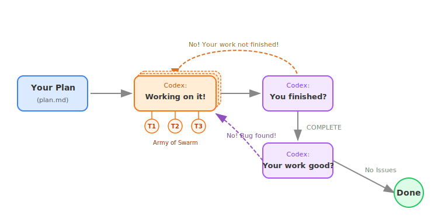

# Humanize-codex

**Current Version: 1.15.3**

> Derived from the [GAAC (GitHub-as-a-Context)](https://github.com/SihaoLiu/gaac) project.

Humanize-codex is a Codex-first RLCR toolkit for plan-driven implementation. It packages scripts, skills, prompts, hooks, and state tracking so Codex can iterate on a written plan, review itself between rounds, and continue from interruptions without losing context.

## What It Does

- Starts a plan-backed RLCR loop from a Markdown plan file
- Persists loop state under `.humanize/rlcr/<timestamp>/`
- Blocks exit until the current round has a summary and passes review logic
- Transitions automatically from implementation to code-review and finalize phases
- Resumes interrupted loops from the active round instead of forcing a restart
- Supports one-shot planning helpers (`gen-plan`, `refine-plan`, `ask-codex`)
- Supports a Codex-only PR review loop for remote bot feedback

## RLCR in One Paragraph

**RLCR** stands for **Ralph-Loop with Codex Review**. In practice, Humanize-codex runs Codex in repeated rounds: implement against the plan, write a round summary, run the gate, accept review feedback, and continue until the work is complete. The same state directory tracks progress across interruptions, so the loop can resume instead of restarting from scratch.

## Current Usage Model

The canonical interface today is:

- install Humanize-codex into the Codex skills runtime
- use the shipped scripts directly
- optionally use the installed skills/flows if your Codex build exposes them

Do **not** assume `/humanize:*` slash commands are available in every Codex build. Some Codex builds expose only built-in slash commands plus `/skills`. The scripts in `scripts/` are the stable interface and always remain the source of truth.

## Install

Recommended:

```bash
./scripts/install-skills-codex.sh
```

Alternative:

```bash
./scripts/install-skill.sh --target codex
```

This installs:

- `humanize`
- `humanize-gen-plan`
- `humanize-refine-plan`
- `humanize-rlcr`

into `${CODEX_HOME:-$HOME/.codex}/skills`.

See:

- [Install for Codex](docs/install-for-codex.md)
- [Install for Codex Plugin](docs/install-for-codex-plugin.md)

## Quick Start

### 1. Generate or refine a plan

Use the installed planning flows from Codex skills:

```bash
/skills
```

Then select the appropriate workflow:

- `humanize-gen-plan`
- `humanize-refine-plan`

In environments that expose plugin-style commands, the matching commands are:

- `/humanize:gen-plan`
- `/humanize:refine-plan`

### 2. Start or resume RLCR

This is the recommended entry point:

```bash
./scripts/start-or-resume-rlcr.sh docs/plan.md
```

Behavior:

- If no active RLCR loop exists, it starts one
- If an active RLCR loop exists, it resumes the active round
- If the local Codex sandbox is broken with the known `bwrap` loopback error, it retries without sandboxing automatically

### 3. Monitor progress

```bash
source /home/yu.cheng/humanize/scripts/humanize.sh
humanize monitor rlcr
```

### 4. Cancel a loop

```bash
./scripts/cancel-rlcr-loop.sh
```

Use `--force` if the loop is already in finalize phase.

## How RLCR State Is Stored

Each run writes to:

```text
.humanize/rlcr/<timestamp>/
```

Common files:

- `state.md` for active implementation/review rounds
- `finalize-state.md` for finalize phase
- `goal-tracker.md` for immutable goal + mutable task tracking
- `round-N-prompt.md` for the current round instructions
- `round-N-summary.md` for the round output written by Codex
- `round-N-review-result.md` for review feedback
- `finalize-summary.md` for finalize-phase output

Terminal states include files such as:

- `complete-state.md`
- `cancel-state.md`

Those are not resumed.

## Interruption and Resume

If Codex or your terminal is interrupted mid-loop, rerun:

```bash
./scripts/start-or-resume-rlcr.sh docs/plan.md
```

Humanize-codex will detect the active loop and continue from the current round instead of restarting from round 0.

If you only want to inspect the active loop without executing it:

```bash
./scripts/start-or-resume-rlcr.sh --print-only docs/plan.md
```

## PR Review Loop

Humanize-codex also includes a Codex-only PR feedback loop:

```bash
./scripts/setup-pr-loop.sh --codex
```

This loop:

- finds the current PR
- fetches remote Codex bot comments
- lets local Codex fix issues
- re-triggers review
- continues until approval or termination

## Workflow Diagram

<p align="center">
  
</p>

## Monitor Dashboard

<p align="center">
  
</p>

## Repository Surfaces

- [`scripts/`](scripts) - canonical operational interface
- [`skills/`](skills) - installable Codex/Kimi skills and flows
- [`hooks/`](hooks) - RLCR and PR-loop enforcement logic
- [`prompt-template/`](prompt-template) - generated prompt scaffolding
- [`commands/`](commands) - plugin-style command definitions for environments that load them
- [`.codex-plugin/plugin.json`](.codex-plugin/plugin.json) - plugin metadata
- [`.agents/plugins/marketplace.json`](.agents/plugins/marketplace.json) - local marketplace metadata

## Documentation

- [Usage Guide](docs/usage.md) -- Commands, options, environment variables
- [Install for Codex](docs/install-for-codex.md) -- Codex skill runtime setup
- [Install for Codex Plugin](docs/install-for-codex-plugin.md) -- Repo-local plugin metadata and hook layout
- [Install for Kimi](docs/install-for-kimi.md) -- Kimi CLI skill setup
- [Configuration](docs/usage.md#configuration) -- Shared config hierarchy and override rules
- [Bitter Lesson Workflow](docs/bitlesson.md) -- Project memory, selector routing, and delta validation

## Practical Notes

- The most reliable entry point is `scripts/start-or-resume-rlcr.sh`.
- If your Codex build does not recognize `/humanize:*` commands, use scripts directly.
- Humanize-codex persists state in Markdown files so the loop remains inspectable and recoverable.
- The repo expects plan-first execution. Humanize-codex is strongest when the plan is explicit and stable.

## License

MIT
